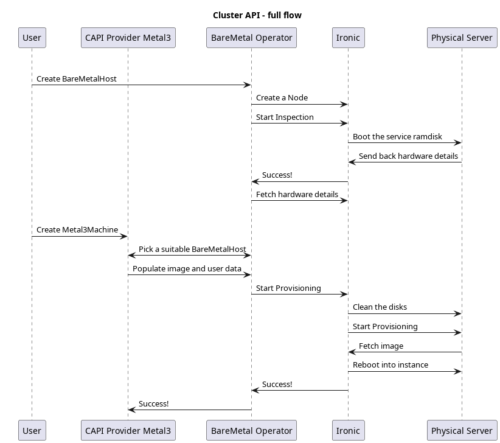

# Bare Metal Operator

The Bare Metal Operator (BMO) is a Kubernetes controller that manages
bare-metal hosts, represented in Kubernetes by `BareMetalHost` (BMH) *custom
resources*.

BMO is responsible for the following operations:

- Inspecting the host’s hardware and reporting the details on the corresponding
  BareMetalHost. This includes information about CPUs, RAM, disks, NICs, and
  more.
- Optionally preparing the host by configuring RAID, changing firmware settings
  or updating the system and/or BMC firmware.
- Provisioning the host with a desired image.
- Cleaning the host’s disk contents before and after provisioning.

Under the hood, BMO uses [Ironic](../ironic/introduction) to conduct these
actions.

## Enrolling BareMetalHosts

To enroll a bare-metal machine as a `BareMetalHost`, you need to know at least
the following properties:

1. The IP address and credentials of the BMC - the remote management controller
   of the host.
2. The protocol that the BMC understands. Most common are IPMI and Redfish.
   See [supported hardware](supported_hardware) for more details.
3. Boot technology that can be used with the host and the chosen protocol.
   Most hardware can use network booting, but some Redfish implementations also
   support virtual media (CD) boot.
4. MAC address that is used for booting. **Important:** it's a MAC address of
   an actual NIC of the host, not the BMC MAC address.
5. The desired boot mode: UEFI or legacy BIOS. UEFI is the default and should
   be used unless there are serious reasons not to.

This is a minimal example of a valid BareMetalHost:

```yaml
apiVersion: metal3.io/v1alpha1
kind: BareMetalHost
metadata:
  name: node-0
  namespace: metal3
spec:
  bmc:
    address: ipmi://192.168.111.1:6230
    credentialsName: node-0-bmc-secret
  bootMACAddress: 00:5a:91:3f:9a:bd
  online: true
```

When this resource is created, it will undergo *inspection* that will populate
more fields as part of the `status`.

## Deploying BareMetalHosts

To provision a bare-metal machine, you will need a few more properties:

1. The URL and checksum of the image. Images should be in QCOW2 or raw format.
   It is common to use various cloud images with BMO, e.g.
   [Ubuntu](https://cloud-images.ubuntu.com/) or
   [CentOS](https://cloud.centos.org/centos/). **Important:** not all images
   are compatible with UEFI boot - check their description.
2. Optionally, user data: a secret with a configuration or a script that is
   interpreted by the first-boot service embedded in your image. The most
   common service is
   [cloud-init](https://cloudinit.readthedocs.io/en/latest/index.html), some
   distributions use [ignition](https://coreos.github.io/ignition/).
3. Optionally, network data: a secret with the network configuration that is
   interpreted by the first-boot service. In some cases, the network data is
   embedded in the user data instead.

Here is a complete example of a host that will be provisioned with a CentOS 9
image:

```yaml
apiVersion: metal3.io/v1alpha1
kind: BareMetalHost
metadata:
  name: node-0
  namespace: metal3
spec:
  bmc:
    address: ipmi://192.168.111.1:6230
    credentialsName: node-0-bmc-secret
  bootMACAddress: 00:5a:91:3f:9a:bd
  image:
    checksum: http://172.22.0.1/images/CENTOS_9_NODE_IMAGE_K8S_v1.29.0.qcow2.sha256sum
    url: http://172.22.0.1/images/CENTOS_9_NODE_IMAGE_K8S_v1.29.0.qcow2
  networkData:
    name: test1-workers-tbwnz-networkdata
    namespace: metal3
  online: true
  userData:
    name: test1-workers-vd4gj
    namespace: metal3
status:
  hardware:
    cpu:
      arch: x86_64
      count: 2
    hostname: node-0
    nics:
    - ip: 172.22.0.73
      mac: 00:5a:91:3f:9a:bd
      name: enp1s0
    ramMebibytes: 4096
    storage:
    - hctl: "0:0:0:0"
      name: /dev/sda
      serialNumber: drive-scsi0-0-0-0
      sizeBytes: 53687091200
      type: HDD
```

## Integration with the cluster API

[CAPM3](../capm3/introduction) is the Metal3 component that is responsible for
integration between Cluster API resources and BareMetalHosts. When using Metal3
with CAPM3, you will enroll BareMetalHosts as described above first, then use
`Metal3MachineTemplate` to describe how hosts should be deployed, i.e. which
images and user data to use.

This happens for example when the user scales a MachineDeployment so that the
server should be added to the cluster, or during an upgrade when it must change
the image it is booting from:


