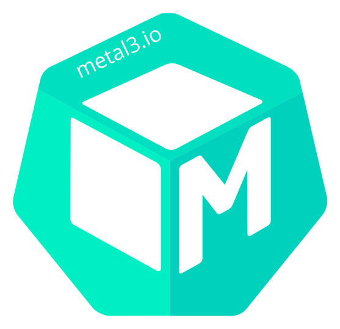

    

# What is Metal³

Metal³ project (pronounced: Metal Kubed) exists to provide components
that allow you to do bare metal host management for Kubernetes. Metal³
works as a Kubernetes application, meaning it runs on Kubernetes and is
managed through Kubernetes interfaces.

The Metal³ project is also building integration with the Kubernetes
[Cluster API][Cluster API] project, allowing Metal³ to be used as an
infrastructure backend for Machine objects from the Cluster API.

## Why another provisioning tool

In fact there are existing solutions like Openstack [Ironic][Ironic]
to provision bare metal machines. Some of the reasons are:

1. We wanted to create Kubernetes native API to do the lifecycle management
  of bare metal machines
2. Wa wanted to have the self hosted management

3. 

### Getting started

* [Quick start][Quick start]

## Community

Metal³ community is constantly growing and we would be happy to collaborate
with you. If you are interested in Metal³ or would like to reach out the
community then come and talk to us!

* We are available on Kubernetes [slack][slack] in the
  [#cluster-api-baremetal][#cluster-api-baremetal] channel
* Join to the [Metal3-dev][Metal3-dev] google group for the edit access to the
  [Community meetings Notes][Community meetings Notes]
* Subscribe to the [Metal³ Development Mailing List][Metal³ Development Mailing List]
  for the project related anouncements, discussions and questions.
* Come and meet us in our weekly community meetings on every
  Wednesday at 13:00 UTC on [Zoom][Zoom]
* If you missed the previous community meeting, you can still find the notes
  [here][notes] and recordings [here][recordings]

For bugs and feature requests please submit an issue on [Github][Github].

## Code of Conduct

See our [Code of Conduct][Code of Conduct]

## Licence

All the source code in Metal³ is released under the [Apache License 2.0][Licence]

[Cluster API]: https://github.com/kubernetes-sigs/cluster-api
[slack]: http://slack.k8s.io/
[#cluster-api-baremetal]: https://kubernetes.slack.com/messages/CHD49TLE7
[Metal3-dev]: https://groups.google.com/forum/#!forum/metal3-dev
[Community meetings Notes]: https://groups.google.com/forum/#!forum/metal3-dev
[Metal³ Development Mailing List]: https://docs.google.com/document/d/1d7jqIgmKHvOdcEmE2v72WDZo9kz7WwhuslDOili25Ls/edit
[Zoom]: https://zoom.us/j/97255696401?pwd=ZlJMckNFLzdxMDNZN2xvTW5oa2lCZz09
[notes]: https://docs.google.com/document/d/1d7jqIgmKHvOdcEmE2v72WDZo9kz7WwhuslDOili25Ls/edit
[recordings]: https://www.youtube.com/playlist?list=PL2h5ikWC8viJY4SNeOpCKTyERToTbJJJA
[Code of Conduct]: https://github.com/metal3-io/metal3-docs/blob/master/CODE_OF_CONDUCT.md
[Licence]: http://www.apache.org/licenses/
[Github]: https://github.com/metal3-io
[Quick start]: https://metal3.io/try-it.html
[Ironic]: https://docs.openstack.org/ironic/latest/