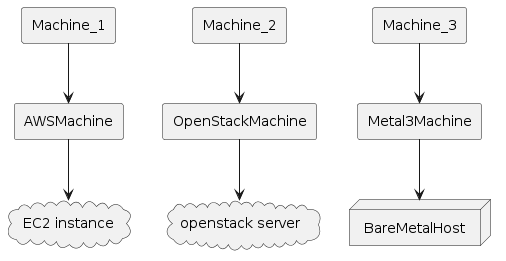
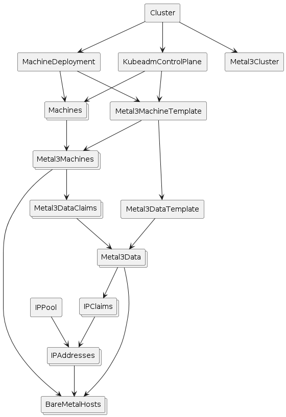

# Project overview

Metal3 consists of multiple sub-projects. The most notable are [Bare Metal
Operator](https://github.com/metal3-io/baremetal-operator), [Cluster API
provider Metal3](https://github.com/metal3-io/cluster-api-provider-metal3) and
the [IP address manager](https://github.com/metal3-io/ip-address-manager). There
is no requirement to use all of them.

The stack, when including Cluster API and Ironic, looks like this:

From a user perspective it may be more useful to visualize the Kubernetes
resources. When using Cluster API, Metal3 works as any other infrastructure
provider. The Machines get corresponding Metal3Machines, which in turn reference
the BareMetalHosts.

The following diagram shows more details about the Metal3 objects. Note that it
is not showing everything and is meant just as an overview.

## How does it work?

Metal3 relies on Ironic for interacting with the physical machines. Ironic in
turn communicates with [Baseboard Management
Controllers](https://en.wikipedia.org/wiki/Intelligent_Platform_Management_Interface#Baseboard_management_controller)
(BMCs) to manage the machines. Ironic can communicate with the BMCs using
protocols such as Redfish, IPMI, or iDRAC. In this way, it can power on or off
the machines, change the boot device, and so on. For more information, see
[Ironic in Metal3](./ironic/introduction.md)

For more advanced operations, like writing an image to the disk, the [Ironic
Python Agent](./ironic/ironic-python-agent.md) (IPA) is first booted on the
machine. Ironic can then communicate with the IPA to perform the requested
operation.

The BareMetal Operator (BMO) is a Kubernetes controller that exposes parts of
Ironic's capabilities through the Kubernetes API. This is essentially done
through the BareMetalHost custom resource.

The Cluster API infrastructure provider for Metal3 (CAPM3) provides the
necessary functionality to make Metal3 work with [Cluster
API](https://cluster-api.sigs.k8s.io/). This means that Cluster API can be used
to provision bare metal hosts into workload clusters. Similar to other
[infrastructure
providers](https://cluster-api.sigs.k8s.io/reference/providers#infrastructure),
CAPM3 adds custom resources such as Metal3Cluster and Metal3MachineTemplate in
order to implement the Cluster API contract.

A notable addition to the contract is the management of metadata through
Metal3DataTemplates and related objects. Users can provide metadata and network
data through these objects. For network data specifically, it is worth
mentioning the Metal3 [IP address manager (IPAM)](./ipam/introduction.md) that
can be used to assign IP addresses to the hosts.

## Requirements

- Server(s) with baseboard management capabilities (i.e. Redfish, iDRAC, IPMI,
  etc.). For development you can use virtual machines with Sushy-tools. More
  information [here](./bmo/supported_hardware.md).
- An Ironic instance. More information [here](./ironic/introduction.md).
- A Kubernetes cluster (the management cluster) where the user stores and
  manages the Metal3 resources. A [kind cluster](https://kind.sigs.k8s.io/) is
  enough for bootstrapping or development.
